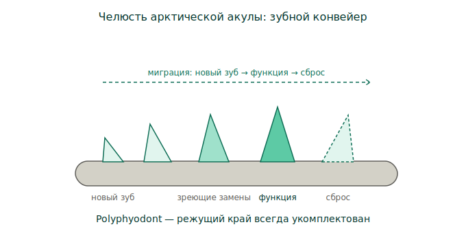
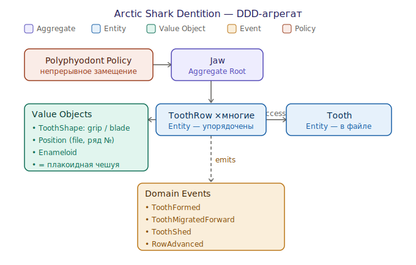

# Arctic Shark Dentition (bounded context)

Зубы арктической акулы (гренландская, *Somniosus microcephalus*) как ограниченный
контекст. Часть домена [[dentition-domain]]; визави — [[human-teeth-ddd]].

Контекст особенно показателен: гренландская акула — рекордсмен-долгожитель среди
позвоночных (оценки ~250–390 лет), живёт в холодной глубокой Арктике с предельно
медленным метаболизмом. Зубная система должна держать **режущий край исправным
веками**. О самом организме как носителе долголетия — [[greenland-shark]];
о её долголетии как архитектурном паттерне — [[longevity-by-design]].

## Анатомия: зубной конвейер

*Polyphyodont-замещение как конвейер — [открыть SVG](Arch/arctic-shark-jaw.svg)*

- Зубы сидят не в костных лунках, а крепятся соединительной тканью к **хрящевой**
  челюсти (скелет акулы — хрящ).
- Новые зубы закладываются с внутренней стороны и **мигрируют наружу** к
  функциональной позиции, изношенные сбрасываются. Это и есть конвейер.
- **Гетеродонтия (dignathic):** верхние зубы узкие, заострённые — удержать добычу;
  нижние широкие, скошенные, сцеплены в сплошной режущий край — вырезать куски.

## Тактическая модель

*Aggregate, entities, value objects, events, policy — [открыть SVG](Arch/arctic-shark-teeth-ddd.svg)*

- **Aggregate Root: `Jaw`.**
- **Entity `ToothRow` (×многие)** — упорядоченные ряды; внутри них entity `Tooth`
  выстроены в `ToothFile` (колонка преемственности).
- **Value Objects:** `ToothShape` (`grip` сверху / `blade` снизу), `Position`
  (файл + номер ряда), `Enameloid`. Отдельно важный VO: **зуб = плакоидная
  чешуя** (дермальный дентикул) — это *shared kernel* с контекстом «кожа»: зубы
  акулы и её чешуя — один тип структуры.
- **Domain Events:** `ToothFormed` → `ToothMigratedForward` → `ToothShed` →
  `RowAdvanced`. Поток событий и есть конвейер.

## Главная policy и инвариант

**`Polyphyodont Policy`: непрерывное пожизненное замещение.** Инвариант:
**режущий край всегда укомплектован** — потеря зуба не терминальна, а лишь
запускает `RowAdvanced`. Прямая противоположность инварианту [[human-teeth-ddd]].

## Связь с регенерацией человека

Именно эту policy медицина пытается «портировать» в человеческий контекст — см.
[[usag-1]] и карту переноса в [[dentition-domain]].

## Открытые вопросы

- Скорость конвейера на холоде: как медленный метаболизм влияет на темп
  замещения у гренландской акулы? (нужны первичные данные)
- Точное число зубов и формула рядов у *S. microcephalus* — уточнить по
  источникам (статус `growing`).
