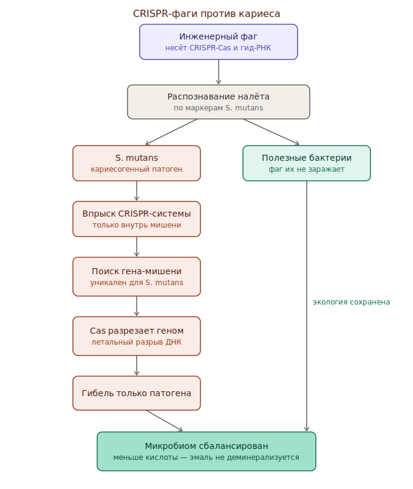

# CRISPR-фаги против кариесогенных бактерий

Видоспецифичное «оружие»: [[bacteriophage]] доставляет систему [[crispr-cas9]]
внутрь конкретного патогена ([[streptococcus-mutans]]), и нуклеаза режет
**собственный геном бактерии** — летальный разрыв. Бьёт по виду, не по площади.

*Фаг распознаёт S. mutans → впрыск CRISPR → разрез генома → гибнет только патоген, союзники целы.*

## Почему это про экологию, а не про зуб

Кариес — инфекционно-экологическая болезнь: закисляют налёт конкретные
ацидогенные виды. Антибиотики и хлоргексидин выжигают и комменсалов, держащих
pH в норме. CRISPR-фаги убирают только врага → ниша остаётся за «правильными»
бактериями, что само мешает патогену вернуться.

## Механизм по шагам

1. **Носитель — фаг.** Узкий хозяйский диапазон = первый уровень адресности:
   стыкуется только с рецепторами [[streptococcus-mutans]].
2. **Груз — Cas + гид-РНК**, настроенная на последовательность, уникальную для
   патогена (видоспецифичный участок или ген вирулентности, напр. `gtfB`).
3. **Впрыск** системы только внутрь мишени.
4. **Самоликвидация.** Cas вносит двунитевой разрыв в геном бактерии → без
   репарации это летально.
5. **Союзники нетронуты.** Комменсалы (напр. *S. sanguinis*) не заражены и не
   разрезаны → экология сохранена.

## Место в картине

Действует **до** повреждения (профилактика), убирая причину. Дополняет
[[p11-4-peptide]] и [[usag-1]] — см. конвейер в [[dental-regeneration]].

## Открытые вопросы

- Устойчивость *S. mutans* к фагу/CRISPR — эволюционный ответ?
- Доставка и удержание фага в биоплёнке in vivo?
- Горизонтальный перенос груза к комменсалам — риск?
