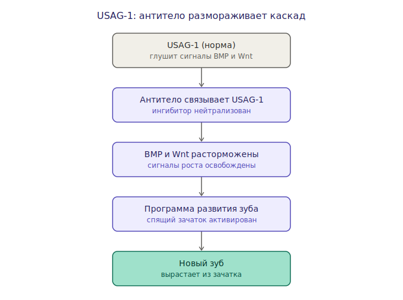

# Регенерация зубов: три архитектуры (MOC)

Три принципиально разных способа борьбы с разрушением зуба. Ключ к их сравнению —
**на каком уровне действует каждый** (см. ось из [[genetic-engineering]]).

## Подходы

- [[p11-4-peptide]] — минеральный уровень, снизу вверх: реминерализует уже
  повреждённую эмаль.
- [[usag-1]] — генетический/сигнальный уровень: расконсервирует заблокированный
  механизм роста нового зуба.
- [[crispr-antimicrobials]] — экологический уровень: точечно убирает патоген
  ([[streptococcus-mutans]]), не трогая комменсалов.

## Сравнение

| Подход | Уровень | Что делает | Когда применим |
|---|---|---|---|
| [[crispr-antimicrobials]] | экология рта | убирает источник кислоты | профилактика, до повреждения |
| [[p11-4-peptide]] | минеральный | реминерализует повреждённую эмаль | ранний кариес |
| [[usag-1]] | генетический | отращивает новый зуб | необратимая утрата |

## Почему они совместимы

Действуют на разных уровнях и не конкурируют за один механизм. Складываются в
естественный конвейер во времени:

```
устранить причину → починить минерал → отрастить заново
   CRISPR              P11-4              USAG-1
```

CRISPR защищает плод труда остальных двух: без устранения кислотной атаки любая
новая эмаль ([[enamel-remineralization]]) снова попадёт под удар.

## Диаграммы


*1. P11-4: минеральный уровень, снизу вверх.*


*2. USAG-1: генетический уровень, размораживает рост.*


*3. CRISPR-фаги: экологический уровень, убирают патоген.*

Все схемы — в архиве [[Arch/README|Arch]].

## Открытые вопросы

- Реальны ли межлекарственные взаимодействия при совместном применении?
- У USAG-1 — насколько контролируем рост: один зуб или риск лишних?
