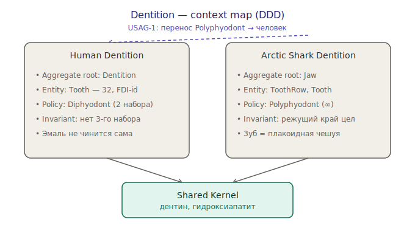

# Dentition: домен «зубы» глазами DDD

Эксперимент: описать биологию зубов языком **Domain-Driven Design**. Не метафора
ради красоты — приём заставляет назвать сущности, границы и правила явно, и тогда
сравнение видов превращается в сравнение **архитектур**, а не «у кого зубы острее».

Два ограниченных контекста (bounded contexts):

- [[human-teeth-ddd]] — `Human Dentition`
- [[arctic-shark-teeth-ddd]] — `Arctic Shark Dentition` (гренландская акула)

## Карта контекстов

*Два контекста, общее ядро и перенос возможности — [открыть SVG](Arch/dentition-context-map.svg)*

Что показывает карта:

- **Shared Kernel.** Общее ядро обоих контекстов — минерализованная ткань
  (дентин + гидроксиапатит/энамелоид). Базовый «материал зуба» один на всех
  позвоночных; контексты расходятся в том, как они этим материалом управляют.
- **Разные policy при общем намерении.** Оба контекста реализуют один концепт
  убиквитозного языка — «заместить утраченный зуб», — но **по-разному**:
  человек ограничен `Diphyodont` (двумя поколениями), акула живёт на
  `Polyphyodont` (бесконечный конвейер).
- **Перенос возможности.** Регенеративная терапия [[usag-1]] — это, по сути,
  попытка портировать способность непрерывного замещения из «акульего» контекста
  в человеческий, сняв инвариант «третьего набора нет».

## Убиквитозный язык (общий словарь)

| Термин | Биология | DDD-роль |
|---|---|---|
| Tooth | отдельный зуб | Entity (есть identity) |
| EnamelLayer / Enameloid | твёрдое покрытие | Value Object |
| Eruption | прорезывание | Domain Event |
| Shedding / Exfoliation | выпадение | Domain Event |
| Diphyodont / Polyphyodont | смена зубов | Policy + Invariant |
| Jaw / Dentition | челюсть / зубная дуга | Aggregate Root |

## Зачем это в базе по генной инженерии

Чтобы инженерить регенерацию ([[dental-regeneration]]), полезно сначала точно
описать **что мы вообще меняем**: какие инварианты держат текущую систему и какой
из них нужно снять. DDD — это и есть язык про инварианты. См. ось уровней в
[[genetic-engineering]].

## Открытые вопросы

- Где границы агрегата проходят биологически корректно: зуб + связка + кость —
  один агрегат или соседние?
- Корректно ли считать пульпу Entity, а эмаль — Value Object? (identity vs
  взаимозаменяемость)
