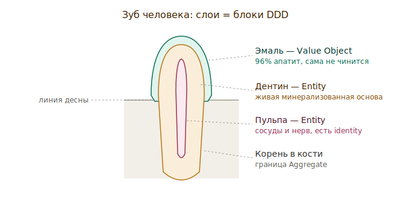
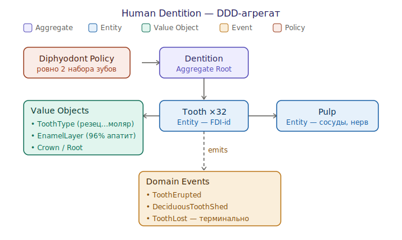

# Human Dentition (bounded context)

Зубы человека как ограниченный контекст. Часть домена [[dentition-domain]];
контекст-визави — [[arctic-shark-teeth-ddd]].

## Анатомия = строительные блоки

*Слои зуба и их DDD-роли — [открыть SVG](Arch/human-tooth-anatomy.svg)*

- **Эмаль — Value Object.** ~96% гидроксиапатит, без клеток и сосудов.
  Определяется только составом, не имеет «жизни» и identity → классический value
  object. Ключевое следствие: **нет команды `repair()`** — эмаль не
  восстанавливается организмом. Поэтому реминерализация приходит снаружи как
  отдельный сервис ([[p11-4-peptide]], [[enamel-remineralization]]).
- **Дентин — Entity.** Живая минерализованная основа, реагирует на раздражители.
- **Пульпа — Entity.** Сосуды и нерв; у конкретного зуба своя — есть identity.
- **Корень в кости** задаёт границу агрегата: зуб закреплён в лунке (гомфоз).

## Тактическая модель

*Aggregate, entities, value objects, events, policy — [открыть SVG](Arch/human-teeth-ddd.svg)*

- **Aggregate Root: `Dentition`** (зубная дуга) — точка входа, держит инварианты
  целостности прикуса.
- **Entity `Tooth` ×32** — identity = позиция по FDI. Внутри: value objects
  `ToothType` (резец/клык/премоляр/моляр), `EnamelLayer`, `Crown`/`Root`; и
  entity `Pulp`.
- **Domain Events:** `ToothErupted` (прорезался), `DeciduousToothShed` (выпал
  молочный), `ToothLost` — **терминальное** событие без компенсации.

## Главная policy и инвариант

**`Diphyodont Policy`: ровно два поколения зубов.** 20 молочных → 32 постоянных.
Инвариант контекста: **третьего набора не существует** — потеря постоянного зуба
необратима в рамках текущей системы.

Биологически этот инвариант *активно удерживается* белком-ингибитором — см.
[[usag-1]]. То есть «нет третьего набора» — не отсутствие механизма, а
**включённый стоп-кран**. Снять инвариант = заблокировать USAG-1.

## Контраст с акулой

Там, где у человека `ToothLost` терминально, у [[arctic-shark-teeth-ddd]] оно
лишь триггерит конвейер замены. Один и тот же концепт языка — разная policy.

## Открытые вопросы

- Цемент и периодонтальная связка — часть агрегата `Tooth` или отдельный агрегат
  «крепление»?
- Реминерализация — domain service внутри контекста или внешний bounded context
  (слюна/среда)?
