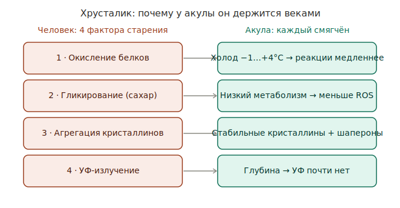

# Долговечность хрусталика (кристаллины)

Глубокий разбор самого яркого примера [[protein-longevity-engineering]]: белки
хрусталика [[greenland-shark]] функционируют сотни лет. Это конкретный механизм
паттерна [[longevity-by-design]].

*Каждый из четырёх факторов старения хрусталика человека у акулы ослаблен.*

## Четыре фактора старения хрусталика у человека

1. Накопление окислительных повреждений.
2. Гликирование белков (сахар повреждает белки).
3. Агрегация кристаллинов → помутнение (катаракта).
4. УФ-излучение.

## Почему у акулы иначе — по каждому фактору

1. **Холод всю жизнь (−1…+4°C).** Организм как биохолодильник: окисление,
   повреждение ДНК и образование радикалов идут в разы медленнее.
2. **Экстремально низкий метаболизм** → меньше ROS, меньше митохондриального
   стресса, меньше повреждений кристаллинов. См. [[damage-firewall]] и
   [[rate-limiter-aging]].
3. **Белки практически не обновляются** — как и у человека центральные волокна
   формируются до рождения, но у акулы должны прослужить века. Предполагают более
   стабильные кристаллины, усиленные шапероны, лучшую защиту от денатурации.
4. **Нет солнечного УФ** — большую часть жизни на глубине сотен метров.

## Важный нюанс

Невозобновляемость белков хрусталика — общая для позвоночных; разница не в
наличии механизма, а в **скорости повреждения**. Это ровно тезис
[[rate-limiter-aging]]: не чинить, а замедлить `dDamage/dt`.

Уточнение: хрусталик всю жизнь растёт, добавляя **новые** корковые волокна — это
*добавление* материала, а не *обновление* уже сформированных ядерных
кристаллинов. Последние не оборачиваются никогда.

## Что подтверждено, что гипотеза

- **Подтверждено (high):** кристаллины ядра хрусталика формируются около
  рождения / в раннем эмбриогенезе и не оборачиваются всю жизнь — поэтому в них
  копятся рацемизация, дезамидирование, изомеризация (нет рибосом → нет ремонта).
  Долгоживущие белки (LLP) — реальный класс: нуклеопорины, гистоны (H3.1, H4),
  коллаген VI.
- **Гипотеза (для акулы):** более стабильные кристаллины и усиленные шапероны
  именно у долгожителей — правдоподобно и изучается, но прямо не доказано.

## Открытые вопросы

- Что именно делает кристаллины долгожителей устойчивее: последовательность,
  шапероны или холодная среда? (активно изучается)
- Каталог человеческих LLP вне хрусталика — насколько он показан на человеке, а
  не экстраполирован с крысиных pulse-chase исследований?

## Источники

- Lynnerup N, Kjeldsen H, Heegaard S, et al. (2008). Radiocarbon dating of the
  human eye lens crystallines reveal proteins without carbon turnover throughout
  life. *PLOS ONE* 3(1):e1529. DOI
  [10.1371/journal.pone.0001529](https://doi.org/10.1371/journal.pone.0001529).
- Toyama BH, Savas JN, Park SK, et al. (2013). Identification of long-lived
  proteins reveals exceptional stability of essential cellular structures.
  *Cell* 154(5):971–982. DOI
  [10.1016/j.cell.2013.07.037](https://doi.org/10.1016/j.cell.2013.07.037).
- Savas JN, Toyama BH, Xu T, et al. (2012). Extremely long-lived nuclear pore
  proteins in the rat brain. *Science* 335(6071):942. DOI
  [10.1126/science.1217421](https://doi.org/10.1126/science.1217421).
