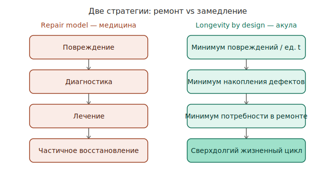
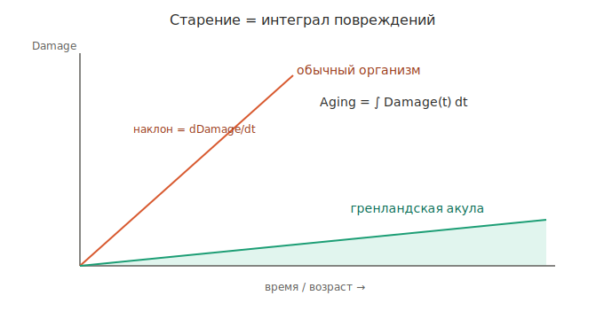
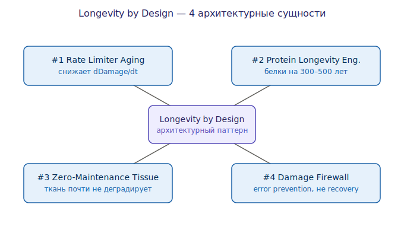
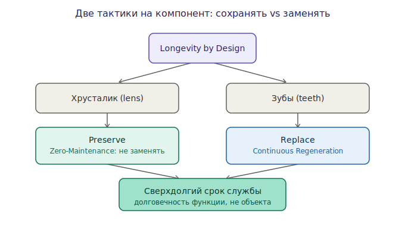

# Longevity by Design

Архитектурный паттерн биогеронтологии: сверхдолголетие достигается **не
постоянным ремонтом**, а проектированием компонентов (белков, тканей,
метаболизма) с экстремально низкой скоростью деградации. Модельный носитель
паттерна — [[greenland-shark]].

## Сдвиг парадигмы: ремонт → предотвращение


*Репарационная модель vs Longevity by design — [открыть SVG](Arch/aging-repair-vs-prevention.svg)*

Исторически антиэйдж = **система ремонта**: повреждение → диагностика → лечение →
частичное восстановление. Акула реализует другую архитектуру: минимум
повреждений в единицу времени → минимум накопления → минимум ремонта →
сверхдолгий цикл. Это разные стратегии, а не разные «настройки» одной.

## Ключевая формула


*Площадь под кривой — интеграл; наклон — производная — [открыть SVG](Arch/damage-rate-integral.svg)*

```
Aging = ∫ Damage(t) dt
```

Большинство терапий уменьшают уже накопленный `Damage` (площадь). Акула
уменьшает саму производную `dDamage/dt` (наклон). На горизонте столетий снижение
скорости в 5–10× даёт несопоставимо больший эффект, чем разовая уборка
накопленного. Это и есть [[rate-limiter-aging]].

## Четыре архитектурные сущности


*Паттерн и его составляющие — [открыть SVG](Arch/longevity-by-design-map.svg)*

1. [[rate-limiter-aging]] — снижать скорость повреждений, а не убирать накопленное.
2. [[protein-longevity-engineering]] — белки, не требующие замены 300–500 лет.
3. [[zero-maintenance-tissue]] — ткани, которые почти не деградируют.
4. [[damage-firewall]] — предотвращение ошибок вместо их детекции и починки.

### Альтернативная формулировка четырёх сущностей

Тот же паттерн часто режут по-другому; вот соответствие:

| Формулировка | Соответствие в базе |
|---|---|
| Slow Metabolism | механизм внутри [[rate-limiter-aging]] / [[damage-firewall]] |
| Protein Preservation | [[protein-longevity-engineering]] → [[lens-crystallin-longevity]] |
| Continuous Regeneration | [[continuous-regeneration]] |
| Damage Avoidance | [[damage-firewall]] |

## Две тактики на компонент: сохранять vs заменять


*Паттерн выбирает тактику под компонент — [открыть SVG](Arch/preserve-vs-replace.svg)*

Ключевой нюанс: акула применяет **две противоположные тактики** к разным
компонентам, и обе дают долговечность.

- **Хрусталик → Preserve** ([[zero-maintenance-tissue]],
  [[lens-crystallin-longevity]]): заменить нельзя, поэтому белок делают
  сверхстабильным.
- **Зубы → Replace** ([[continuous-regeneration]]): износ неизбежен, поэтому
  вечен не зуб, а **процесс замены**.

Вывод-паттерн: долговечность достигается не одной стратегией, а **выбором
стратегии под компонент** — это очень по-инженерному (и очень DDD: тактика на
агрегат, а не на всю систему).

## Почему это может быть важнее нанороботов


*Slow Damage Architecture как фундамент — [открыть SVG](Arch/longevity-stack.svg)*

Нанороботы — это ремонтная служба: ткань → повреждение → наноробот → ремонт.
Даже идеальный ремонт требует энергии и ресурсов. Если ткань деградирует в 100×
медленнее, ремонт нужен редко — и нагрузка на всю систему падает. Отсюда
трёхуровневый стек: **фундамент** (Slow Damage Architecture) снижает нагрузку
на надстройку (биосенсоры + ремонт).

## Аналогия из software engineering

Паттерн повторяет переход от «постоянно чиним баги» к «архитектурно исключаем
целые классы ошибок». Прямая параллель — memory-safe языки вроде Rust: не чинить
повреждённую память, а сделать её повреждение невозможным по конструкции.
`Damage Firewall` ≈ borrow checker для биологии.

## Связь с остальной базой

- Организм-носитель — [[greenland-shark]] (он же в зубном контексте
  [[arctic-shark-teeth-ddd]]).
- Контраст со «строительными» подходами регенерации — [[dental-regeneration]]:
  там чинят/отращивают, здесь — замедляют деградацию.
- Уровни вмешательства — [[genetic-engineering]].

## Открытые вопросы

- Конкретные числа (5–10×, 100×, 300–500 лет) — иллюстративные; нужны источники.
- Переносимы ли механизмы холоднокровного глубоководного вида на тёплый
  быстрый метаболизм человека?
