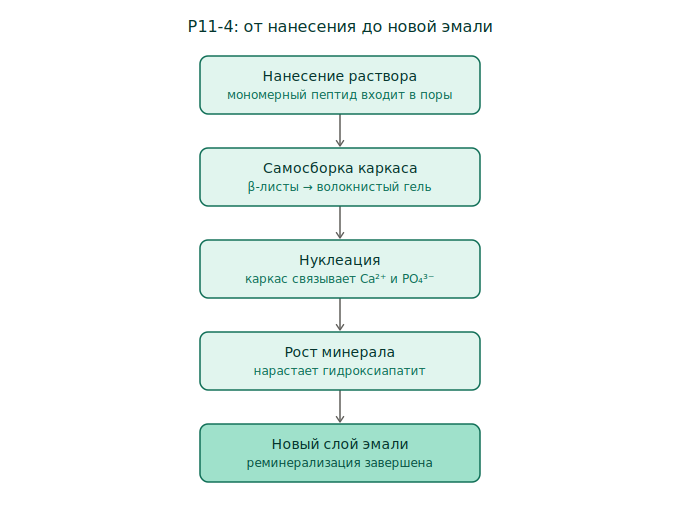

# P11-4

Синтетический пептид (11 аминокислот), который при нанесении на повреждённую эмаль
**самособирается в трёхмерный каркас** и работает матрицей-затравкой для роста
нового минерала. Подход «снизу вверх»: не пломбирует, а достраивает.

*Нанесение → самосборка каркаса → нуклеация → рост минерала → новый слой эмали.*

## Механизм по шагам

1. **Нанесение** — низковязкий раствор мономерного пептида проникает в поры
   ранней кариозной полости (подповерхностное повреждение).
2. **Триггер сборки** — в среде полости рта (pH, ионная сила) мономеры
   полимеризуются в β-листы → волокнистый гель-каркас.
3. **Нуклеация** — каркас связывает ионы кальция и фосфата, задавая места
   зарождения кристаллов гидроксиапатита.
4. **Рост** — новая минеральная фаза нарастает по матрице → см.
   [[enamel-remineralization]].

## Граница применимости

Работает на **ранних, ещё некавитированных** повреждениях (белое пятно). Дырку как
пломба не закрывает. Не трогает причину кариеса — её адресует
[[crispr-antimicrobials]].

Место в общей картине — см. [[dental-regeneration]].

## Открытые вопросы

- Долговечность новообразованного минерала vs естественная эмаль?
- Что именно служит триггером сборки in vivo — точные параметры?

> Утверждения нуждаются в сверке с первичными источниками (статус `growing`).
